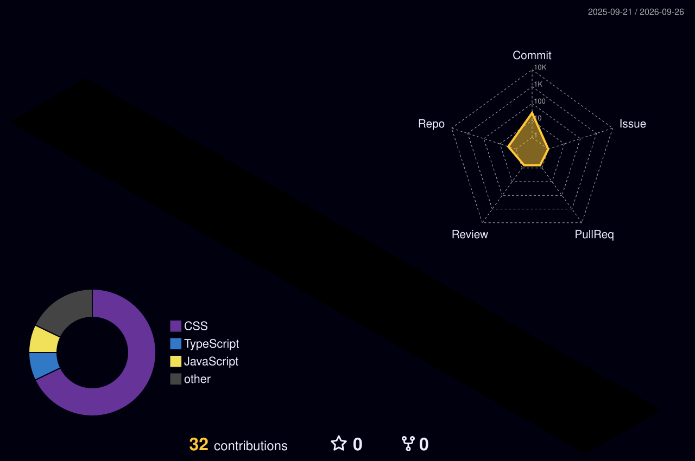

<div align="center">


<a href="https://mczdj.github.io/">
  
</a>
<a href="https://www.linkedin.com/in/mohamed-idris-055345212/">
  
</a>
<a href="mailto:MohamedIdres7@outlook.com">
  
</a>

<br><br>

<a href="https://tryhackme.com/p/mczdj2">
  
</a>
<a href="https://app.hackthebox.com/users/2035138">
  
</a>

<br><br>


</div>

---

## 👋 About Me

I am **Mohamed Idris**, a Cybersecurity Engineering student at **Abu Dhabi University** with hands-on experience in IT support, network security, penetration-testing labs, Raspberry Pi security projects, and cybersecurity awareness initiatives.

I enjoy turning security concepts into practical projects. My work includes DNS threat defence, rogue-access-point analysis, intrusion detection, IoT automation, network traffic analysis, and secure system development.

```text
Location      Abu Dhabi, United Arab Emirates
Current role  IT Department Intern — Abu Dhabi University
Education     B.S. in Cybersecurity Engineering
Interests     Networking · Penetration Testing · SOC Operations · AI Security
Goal          Build practical security expertise and contribute to safer systems
```

## 🔭 What I Am Working On

- Strengthening my penetration-testing and network-analysis skills
- Practising offensive and defensive security through TryHackMe and Hack The Box
- Building security projects with Python, Linux, Raspberry Pi, Wireshark, and Scapy
- Learning more about SOC operations, incident response, and vulnerability assessment
- Improving my portfolio through documented projects, case studies, and technical reports

## 🧰 Technical Skills

<div align="center">


</div>

### Security and Networking


## 🧪 Hands-On Security Platforms

<details open>
<summary><strong>TryHackMe — @mczdj2</strong></summary>
<br>

Guided cybersecurity learning paths and practical labs covering networking, Linux, web security, defensive security, and introductory penetration testing.

[](https://tryhackme.com/p/mczdj2)

</details>

<details open>
<summary><strong>Hack The Box — @mczdj</strong></summary>
<br>

Hands-on machines and security challenges used to develop enumeration, exploitation, problem-solving, and attack-path analysis skills.

[](https://app.hackthebox.com/users/2035138)

</details>

## 🚀 Featured Projects

### 🛡️ NetSentinel
**Automated Phishing Detection and DNS Security System**

A cybersecurity capstone project designed to filter malicious DNS traffic, enrich suspicious-domain data, and provide centralised monitoring for SMEs and remote users.

`Python` `Flask` `Unbound DNS` `PostgreSQL` `Ubuntu`

[View the case study on my portfolio](https://mczdj.github.io/#projects)

---

### 📡 Evil Twin Attack Simulation
**Raspberry Pi Rogue Access Point and Network Traffic Analysis**

A controlled academic simulation using a Raspberry Pi as a rogue access point, followed by DNS, HTTP, and packet-traffic analysis in an authorised lab environment.

`Raspberry Pi` `Kali Linux` `Wireshark` `tcpdump` `dnsmasq`

[View the case study on my portfolio](https://mczdj.github.io/#projects)

---

### 🔍 Raspberry Pi Network IDS
**Lightweight Network Intrusion Detection for IoT Devices**

Contributed to IDS functionality and result validation for a Python-based intrusion-detection system that monitors traffic, identifies suspicious activity, and records security events.

`Python` `Scapy` `Raspberry Pi` `Nmap` `iptables`

[View repository](https://github.com/amssidds/IoT_IDS) · [View portfolio case study](https://mczdj.github.io/#projects)

---

### 🤝 SkillSwap UAE
**RESTful Peer-to-Peer Skills Exchange Platform**

A distributed web application where mentors and learners publish skills, register for sessions, and manage participation through credits and rewards.

`Java` `Spring Boot` `REST API` `MySQL` `BCrypt`

[View the case study on my portfolio](https://mczdj.github.io/#projects)

---

### 🚪 Automatic Gate Control System
A TkCircuit and Raspberry Pi GPIO simulation using distance-based detection, servo control, status LEDs, and state-machine logic.

[View repository](https://github.com/mczdj/Automatic-Gate-System)

### 🌡️ Temperature Monitoring and Emergency System
A TkCircuit-based monitoring system with temperature-state logic, emergency alerts, buzzer control, and simulated ventilation.

[View repository](https://github.com/mczdj/Temperature-Sensor-System)

## 🎓 Selected Cybersecurity Credentials

<details>
<summary><strong>View selected certificates and training</strong></summary>
<br>

- Cisco Networking Academy — CyberOps Associate course completion
- Cisco Networking Academy — Junior Cybersecurity Analyst Career Path
- Cisco Networking Academy — Introduction to Cybersecurity
- TryHackMe — Pre Security learning path
- TryHackMe — Introduction to Cyber Security learning path
- Network Pentesting 101 workshop
- Router Hacking workshop
- CTF Fundamentals workshop
- IBM Cognitive Class — Python 101 for Data Science

[Browse the complete certificate archive](https://github.com/mczdj/mczdj.github.io/tree/main/Certificates)

</details>

## 💼 Current Experience

- **IT Department Intern — Abu Dhabi University**  
  Technical support, network troubleshooting, IT asset auditing, domain configuration, security compliance, and cybersecurity initiatives.

- **Tutor — Sylvan Learning**  
  One-to-one and small-group instruction across Mathematics, English, Physics, Islamic Studies, and introductory Programming.

- **Hybrid Freelance Administrator & Front-End Developer — Knowledge Group Consulting**  
  Digital course content, front-end implementation, quality control, and team coordination.

[View my complete work, volunteering, and events experience](https://mczdj.github.io/#experience)

## 🛰️ Live GitHub Activity

<div align="center">

### 3D Contribution Calendar



<br>

### Profile Overview


<br>


<br>

### Recent Contribution Activity


</div>

> The 3D contribution calendar is generated automatically by GitHub Actions and refreshed every day.

## 🌐 Explore My Portfolio

My portfolio contains complete project case studies, certifications, work experience, volunteering, events, technical skills, and direct links to my professional profiles.

<div align="center">

[](https://mczdj.github.io/)

</div>

## 📫 Connect With Me

<div align="center">

[](https://www.linkedin.com/in/mohamed-idris-055345212/)
[](mailto:MohamedIdres7@outlook.com)
[](https://mczdj.github.io/)
[](https://tryhackme.com/p/mczdj2)
[](https://app.hackthebox.com/users/2035138)

</div>

---

<div align="center">

**Learning continuously. Building practically. Securing thoughtfully.**


</div>
